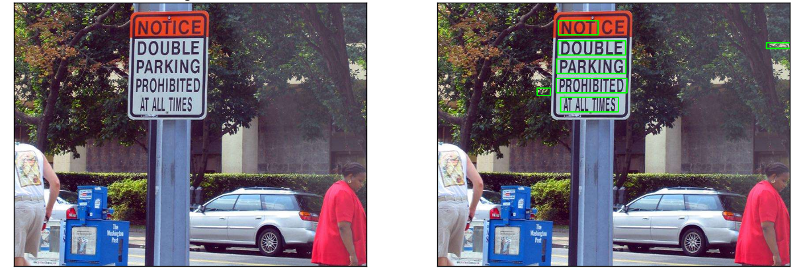
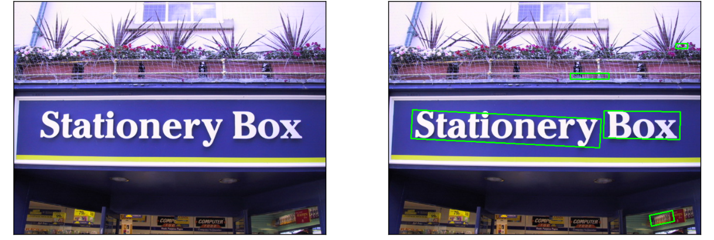

# text-detection

This project aims to detect text regions in images using only image processing techniques with MSER (Maximally Stable Extremal Regions) and SWT (Stroke Width Transform).
Utilized papers are

B. Epshtein, E. Ofek, and Y. Wexler. Detecting text in
natural scenes with stroke width transform. In 2010 IEEE
Computer Society Conference on Computer Vision and
Pattern Recognition, pages 2963–2970, June 2010.

Á. González, L. M. Bergasa, J. J. Yebes, and S. Bronte.
Text location in complex images. In Proceedings of the 21st
International Conference on Pattern Recognition
(ICPR2012), pages 617–620, Nov 2012.

Y. Li and H. Lu. Scene text detection via stroke width.
In Proceedings of the 21st International Conference on
Pattern Recognition (ICPR2012), pages 681–684, Nov
2012.

And also [Tesseract-OCR](https://opensource.google.com/projects/tesseract.)
tool is used at some steps of the algorithm.

## USAGE

`python text_detect.py -i images/scenetext01.jpg -d both+ -t`

Option *-i* is image path, *-d* is SWT direction, *-t* option chooses if Tesseract will be used. Normally Tesseract runs poorly if whole image given as input.
But I use it for final decision of bounding boxes and it is not required all the time.

For more detail (seeing intermediate steps), the usage given below is also available.

`python text_detection_detail.py -i images/scenetext01.jpg -d both+ -t`

## Sample Results

